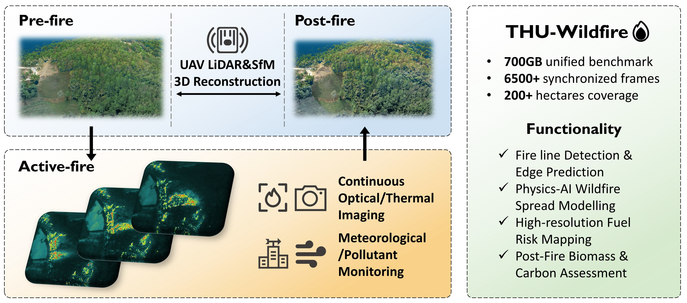

<h1 align="center"> 
 THU-Wildfire 
</h1>

We introduce THU-Wildfire, the first integrated dataset of multitemporal and multimodal observations from four wildfire events. It combines high-precision photogrammetry and 3D point cloud reconstruction before and after fires, continuous visible-light, thermal infrared, and LiDAR monitoring during fire events, time-series records of pollutant concentrations (PM2.5, CO, etc.) and meteorological parameters (wind speed, temperature, humidity, etc.), as well as fine-grained geospatial data on forest structure (tree species, canopy cover, etc.).

## 🆕 News
* 2025-05-16: The subset of THU-Wildfire will be released soon 😊!